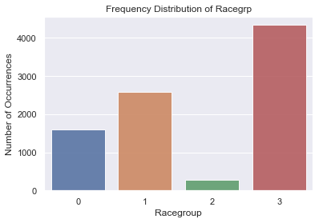
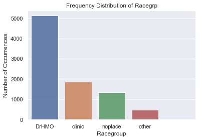
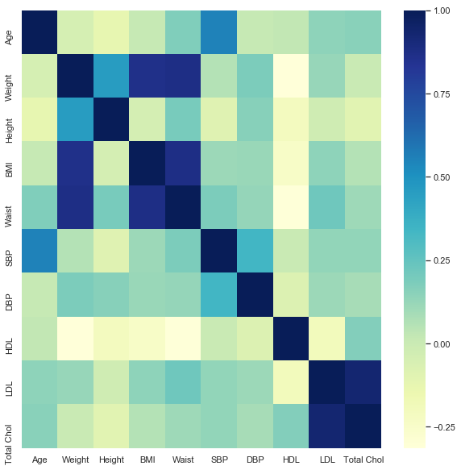

```python
import pandas as pd
import matplotlib.pyplot as plt
import seaborn as sns
```


```python
path= '/Users/shubpuri/Downloads/Health care/Chronic Kidney Disease (Python)/xyz.xls'
```


```python
CKDdata = pd.read_excel (path ,'All Data')

#pd.read_excel()
df=CKDdata

df5=CKDdata
target= df.CKD

df=df.drop('ID', axis=1)
#df.head()
```


```python
#df.dtypes
```


```python
#df.isna().sum().sort_values(ascending=False)

```


```python
#transform Racegrp from Categories black,Hispa, Other, White into 0,1,2,3 respectively
from sklearn.preprocessing import LabelEncoder
# 0 - Black | 1- Hispa | 2- Other | 3- White
lb_make = LabelEncoder()
df["Racegrp"] = lb_make.fit_transform(df["Racegrp"])
#print(df['Racegrp'].value_counts())

```


```python
#PLOTTING RACEGRP
%matplotlib inline
import seaborn as sns
import matplotlib.pyplot as plt
racegrp_count = df['Racegrp'].value_counts()
sns.set(style="darkgrid")
sns.barplot(racegrp_count.index, racegrp_count.values, alpha=0.9)
plt.title('Frequency Distribution of Racegrp')
plt.ylabel('Number of Occurrences', fontsize=12)
plt.xlabel('Racegroup', fontsize=12)
plt.show()
```





```python
#PLOTTING CareSource
%matplotlib inline
import seaborn as sns
import matplotlib.pyplot as plt
racegrp_count = df['CareSource'].value_counts()
sns.set(style="darkgrid")
sns.barplot(racegrp_count.index, racegrp_count.values, alpha=0.9)
plt.title('Frequency Distribution of Racegrp')
plt.ylabel('Number of Occurrences', fontsize=12)
plt.xlabel('Racegroup', fontsize=12)
plt.show()
```





```python
#Change Categories of Caresource from DrHMO, clinic, noplace, other to 1,2,3,4
# 1- DrHMO | 2-clinic | 3- noplace | 4- other 
import numpy as np
df['CareSource'] = np.where(df['CareSource']=='DrHMO', 0,np.where(df['CareSource']=='clinic', 1,
                                                                    np.where(df['CareSource']=='noplace', 2, 3)) )
print(df['CareSource'].value_counts())

```

    0    5123
    1    1873
    2    1353
    3     470
    Name: CareSource, dtype: int64


```python
#Transform Numeric variables(Float and int) into Categorical variables
col_names=['Female','Racegrp','Educ', 'Unmarried', 'Income','CareSource', 'Insured', 'Obese', 'Dyslipidemia', 'PVD', 'Activity', 'PoorVision', 'Smoker', 'Hypertension', 
    'Fam Hypertension', 'Diabetes', 'Fam Diabetes', 'Stroke', 'CVD', 'Fam CVD', 'CHF', 'Anemia' , 'CKD']
for col in col_names:
    df[col] = df[col].astype('category',copy=False)

```


```python
#df.dtypes
```


```python
#Divide the dataset into categorical and Numerical variables
df_num=df.select_dtypes(exclude=['category'])
df_cat=df.select_dtypes(include=['category'])
```


```python
#df_num.isna().sum().sort_values(ascending=False)

```


```python
#Treat NA values by removing the rows with NA in all the variables
df_num=df_num.dropna(subset=['Total Chol', 'HDL','Height','BMI','DBP','Waist','SBP', 'Weight','LDL'])
```


```python
#df_cat.dtypes
```


```python
#T test for Numerical data
#from scipy import stats
#from scipy.stats import ttest_ind
#ttest_ind(df2['Age'], CKDdata['CKD'])
```


```python
#stats.ttest_rel(df2_num['Age'], df2_num['CKD'])
```

# Univariate and Bi-variate Analysis with the Dependent variable 


```python
#NUMBER OF PEOPLE WHO DO NOT HAVE CKD vs WHO HAVE CKD
#sb.countplot(x='CKD',data=df, palette='hls')
```


```python
#sns.countplot(x='Diabetes', hue= 'CKD', data= df2)
```

## Chi square test for all Categorical Variables along Dependent variable CKD


```python
#Now we check Categorical variables that are statistically significant( p-value < 5% )
from scipy.stats import chisquare
import scipy.stats as stats
import numpy as np
#for series in df_cat:
  #  nl = "\n"
 #   crosstab = pd.crosstab(df_cat[f"{series}"], df_cat['CKD'])
#    print(crosstab, nl)
#    chi2, p, dof, expected = stats.chi2_contingency(crosstab)
#    print(f"Chi2 value= {chi2}{nl}p-value= {p}{nl}Degrees of freedom= {dof}{nl}")
 
```


```python
#Dropping Non-Significant Categorical variables based on the Chi-square test
drop_cat= ['Female', 'Obese', 'Dyslipidemia', 'Fam Diabetes']
df= df.drop(drop_cat, axis=1)
```


```python
#Bi-variate Analysis with the Dependent variable 

```

# For Numerical variables, check correlations between independent variables


```python
#Check for correlations using heatmap
correlations= df.corr()
f, ax = plt.subplots(figsize=(10,10))
sns.heatmap(correlations, cmap="YlGnBu")

#Check the correlation values with the independent variables
correlations= df.corr()
#correlations['Age'].sort_values(ascending=False)
```





```python

#BMI is highly correlated with Weight and Waist so we'll remove them
BMIcorr=['Weight', 'Waist']
df= df.drop(BMIcorr, axis=1)

#Total Chol is highly correlated with LDL
df= df.drop('LDL', axis=1)

#Age is highly correlated with SBP
df= df.drop('SBP', axis=1)

```


```python
#df2.isna().sum().sort_values(ascending=False)
```


```python
#Create a copy of dataset df
df2= df.copy()
```


```python
#Treat NA values by removing the rows with NA in all the variables
df2=df.dropna(subset=['Diabetes', 'Anemia', 'Activity', 'Stroke','Total Chol', 'HDL', 'Educ', 'CVD', 'CHF', 
                 'Hypertension','Insured','Height','BMI','DBP','Fam CVD','Unmarried','PoorVision','Income'])
```


```python
y= df2.CKD
y.shape
```


    (6091,)


```python
#Split into CKD is not Null into Train data and CKD= NULL into test data


X_train= df2[:4166]
X_test=df2[4166:]


y_train=df2.CKD[:4166]
y_test=df2.CKD[4166:]

X_train=X_train.drop('CKD', axis=1)
X_test= X_test.drop('CKD', axis=1)

print (X_train.shape, y_train.shape)
print (X_test.shape, y_test.shape)
```

    (4166, 24) (4166,)
    (1925, 24) (1925,)


```python

```


```python
#Now Training data has NO NULL VALUES while the Test data has 1925 Null Values in CKD which we have to predict
#df2.isna().sum().sort_values(ascending=False)
```

## Cross Validation: 


```python
#Dividing the Training dataset into further Train and Validate to check the accuracy
from sklearn.model_selection import train_test_split
X_train2, X_test2, y_train2, y_test2 = train_test_split(
         X_train, y_train, test_size=0.30)
```


```python
from sklearn.linear_model import LogisticRegression

#Fit the model on the new Train and validation set

logmodel = LogisticRegression()
logmodel.fit(X_train2,y_train2)


#model = sm.Logit(X_train2,sm.add_constant(y))
#result = model.fit()
#print(result.summary())


```

    /anaconda3/lib/python3.7/site-packages/sklearn/linear_model/logistic.py:433: FutureWarning: Default solver will be changed to 'lbfgs' in 0.22. Specify a solver to silence this warning.
      FutureWarning)


    LogisticRegression(C=1.0, class_weight=None, dual=False, fit_intercept=True,
              intercept_scaling=1, max_iter=100, multi_class='warn',
              n_jobs=None, penalty='l2', random_state=None, solver='warn',
              tol=0.0001, verbose=0, warm_start=False)


```python
#pd.DataFrame(zip(X_train2.columns, np.transpose(logmodel.coef_)))
```


```python
#Predicting:
pred=logmodel.predict(X_test2)
```


```python
#Confusion matrix and accuracy-
from sklearn.metrics import confusion_matrix
confusion_matrix(y_test2,pred)

```


    array([[1154,    5],
           [  81,   10]])


```python
#Check for Accuracy
from sklearn.metrics import accuracy_score
accuracy_score(y_test2,pred)
```


    0.9312


## Applying the Model on Test dataset
import numpy as np
import pandas as pd
import seaborn as sb
import matplotlib.pyplot as plt
import sklearn

from pandas import Series, DataFrame
from pylab import rcParams
from sklearn import preprocessing
from sklearn.linear_model import LogisticRegression
from sklearn import metrics 
from sklearn.metrics import classification_report


```python
logitmodel=LogisticRegression()
logitmodel.fit(X_train,y_train)
```

    /anaconda3/lib/python3.7/site-packages/sklearn/linear_model/logistic.py:433: FutureWarning: Default solver will be changed to 'lbfgs' in 0.22. Specify a solver to silence this warning.
      FutureWarning)


    LogisticRegression(C=1.0, class_weight=None, dual=False, fit_intercept=True,
              intercept_scaling=1, max_iter=100, multi_class='warn',
              n_jobs=None, penalty='l2', random_state=None, solver='warn',
              tol=0.0001, verbose=0, warm_start=False)


```python
predictfinal=logitmodel.predict(X_test)
```

#WE CANNOT MAKE A CONFUSION MATRIX OR FIND ACCURACY OF THE PREDICTIONS AS y_test CONTAINS NULL VALUES WHICH HAVE BEEN PREDICTED AS predictfinal array variable


```python
logitmodel.coef_
logitmodel.intercept_
```


    array([-3.07113057])


```python
predictfinal1=predictfinal
```


```python
predictfinal1.sum()
```


    31.0


```python

```


```python

```
